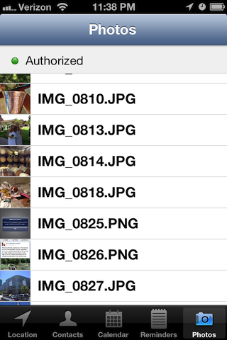

# Data Isolation in iOS 6.0

An iOS app demonstrating the iOS 6.0 data isolation APIs:

* Core Location - Not new to iOS 6.0 but included for completeness; features on-demand authorization.
* Contacts - Permission dialogs were added to the existing C API; requires an explicit authorization call.
* Calendars & Reminders - Reminders were added to Event Kit and each type of data has an independent authorization status; requires an explicit authorization call.
* Photos & Videos - Authorization status does not distinguish between the two media types; features on-demand authorization.

The app also demonstrates how to set a purpose string for each permission.

